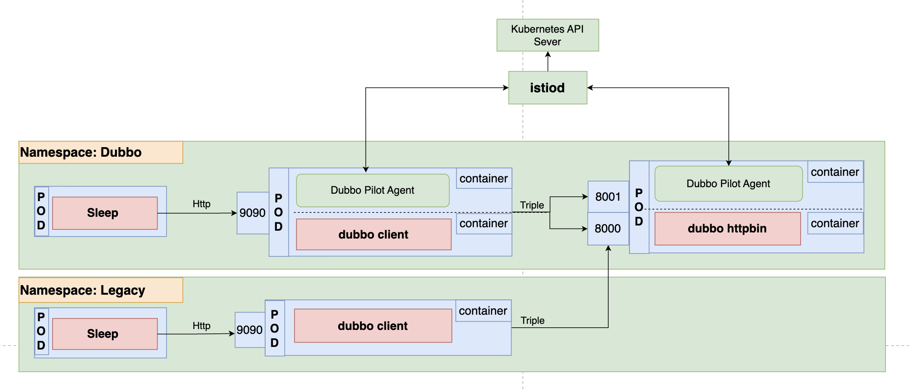

# 一、测试环境
## 1. install istio

https://istio.io/latest/docs/setup/getting-started/

## 2. 测试环境




## 3. 创建命名空间：dubbo

```shell

$ kubectl create ns dubbo
$ kubectl apply -f dubboclient.yaml -n dubbo
$ kubectl apply -f dubbohttpbin.yaml -n dubbo
$ kubectl apply -f sleep.yaml -n dubbo

```

## 4. 创建命名空间：legacy

```shell

$ kubectl create ns legacy
$ kubectl apply -f dubboclient-legacy.yaml -n legacy
$ kubectl apply -f sleep-legacy.yaml -n legacy

```

## 5. 检查 PeerAuthentication, RequestAuthentication, AuthorizationPolicy 

```shell
kubectl get peerauthentication -n dubbo
kubectl get requestauthentication -n dubbo
kubectl get authorizationpolicy -n dubbo
```


# 二、 测试 mtls & PeerAuthentication

## 1. 定义 sleep pod name
```shell
DUBBO_SLEEP_POD=`kubectl get pod -l app=sleep -n dubbo -o jsonpath={.items..metadata.name}`
LEGACY_SLEEP_POD=`kubectl get pod -l app=sleep -n legacy -o jsonpath={.items..metadata.name}`
```

## 2. 应用 PERMISSIVE mode

```shell
kubectl apply -n dubbo -f - <<EOF
apiVersion: security.istio.io/v1beta1
kind: PeerAuthentication
metadata:
  name: default
spec:
  mtls:
    mode: PERMISSIVE
EOF
```

测试联通性

```shell
$ for from in "dubbo" "legacy"; do kubectl exec "$(kubectl get pod -l app=sleep -n ${from} -o jsonpath={.items..metadata.name})" -c sleep -n ${from} -- curl http://dubboclient.${from}.svc:9090/greet -s -o /dev/null -w "sleep.${from} to dubboclient.${from}: %{http_code}\n"; done

sleep.dubbo to dubboclient.dubbo: 200
sleep.legacy to dubboclient.legacy: 200

```

测试数据返回情况

1. dubbo namespace

```shell
kubectl exec "${DUBBO_SLEEP_POD}" -c sleep -n dubbo -- curl http://dubboclient.dubbo.svc:9090/greet -s -H "x-hello-header: hello" | jq

{
  "request": {
    "args": {},
    "form": {},
    "headers": {
      "accept": "*/*",
      "user-agent": "curl/7.81.0",
      "x-hello-header": "hello"
    },
    "method": "GET",
    "origin": "",
    "url": "/greet",
    "envs": {},
    "host_name": "dubboclient-5896c6c856-v9jbn",
    "body": ""
  },
  "response": {
    "greeting": "hello world !",
    "attachments": {
      ":x-host": "10.10.188.33:8001",
      ":x-method": "POST",
      ":x-mtls-mode": "PERMISSIVE",
      ":x-path": "/greet.GreetService/Greet",
      ":x-scheme": "https",
      ":x-spiffe": "spiffe://cluster.local/ns/dubbo/sa/dubboclient",
      "INSTANCE_IP": "10.10.188.33",
      "POD_NAME": "httpbin-66d47bf48-zvzlf",
      "accept": "*/*",
      "accept-encoding": "identity",
      "content-type": "application/grpc+proto",
      "grpc-accept-encoding": "gzip",
      "grpc-timeout": "2999918u",
      "interface": "greet.GreetService",
      "retries": "",
      "te": "trailers",
      "timeout": "",
      "user-agent": "curl/7.81.0",
      "x-hello-header": "hello"
    }
  }
}

```

2. legacy namespace

```shell
kubectl exec "${LEGACY_SLEEP_POD}" -c sleep -n legacy -- curl http://dubboclient.legacy.svc:9090/greet -s -H "x-hello-header: hello" | jq

{
  "request": {
    "args": {},
    "form": {},
    "headers": {
      "accept": "*/*",
      "user-agent": "curl/7.81.0",
      "x-hello-header": "hello"
    },
    "method": "GET",
    "origin": "",
    "url": "/greet",
    "envs": {},
    "host_name": "dubboclient-7688ff887c-dppjp",
    "body": ""
  },
  "response": {
    "greeting": "hello world !",
    "attachments": {
      ":x-method": "POST",
      ":x-mtls-mode": "PERMISSIVE",
      ":x-path": "/greet.GreetService/Greet",
      ":x-scheme": "http",
      "INSTANCE_IP": "10.10.188.33",
      "POD_NAME": "httpbin-66d47bf48-zvzlf",
      "accept": "*/*",
      "accept-encoding": "identity",
      "content-type": "application/grpc+proto",
      "grpc-accept-encoding": "gzip",
      "grpc-timeout": "2999932u",
      "interface": "greet.GreetService",
      "retries": "",
      "te": "trailers",
      "timeout": "",
      "user-agent": "curl/7.81.0",
      "x-hello-header": "hello"
    }
  }
}

```

PERMISSIVE MODE 下 dubbo 和 legacy namespace 都可以访问， Dubbo namespace 下走 mTLS 认证传输， legacy namespace 下走明文传输。

## 3. 应用 STRICT Mode

```shell
kubectl apply -n dubbo -f - <<EOF
apiVersion: security.istio.io/v1beta1
kind: PeerAuthentication
metadata:
  name: default
spec:
  mtls:
    mode: STRICT
EOF


STRICT MODE 测试数据返回情况

1. dubbo namespace

```shell
kubectl exec "${DUBBO_SLEEP_POD}" -c sleep -n dubbo -- curl http://dubboclient.dubbo.svc:9090/greet -s -H "x-hello-header: hello" | jq

{
  "request": {
    "args": {},
    "form": {},
    "headers": {
      "accept": "*/*",
      "user-agent": "curl/7.81.0",
      "x-hello-header": "hello"
    },
    "method": "GET",
    "origin": "",
    "url": "/greet",
    "envs": {},
    "host_name": "dubboclient-5896c6c856-v9jbn",
    "body": ""
  },
  "response": {
    "greeting": "hello world !",
    "attachments": {
      ":x-host": "10.10.188.33:8001",
      ":x-method": "POST",
      ":x-mtls-mode": "STRICT",
      ":x-path": "/greet.GreetService/Greet",
      ":x-scheme": "https",
      ":x-spiffe": "spiffe://cluster.local/ns/dubbo/sa/dubboclient",
      "INSTANCE_IP": "10.10.188.33",
      "POD_NAME": "httpbin-66d47bf48-zvzlf",
      "accept": "*/*",
      "accept-encoding": "identity",
      "content-type": "application/grpc+proto",
      "grpc-accept-encoding": "gzip",
      "grpc-timeout": "2999988u",
      "interface": "greet.GreetService",
      "retries": "",
      "te": "trailers",
      "timeout": "",
      "user-agent": "curl/7.81.0",
      "x-hello-header": "hello"
    }
  }
}

```

2. legacy namespace

```shell
kubectl exec "${LEGACY_SLEEP_POD}" -c sleep -n legacy -- curl http://dubboclient.legacy.svc:9090/greet -s -H "x-hello-header: hello" | jq

Last error is unknown: http request on mtls STRICT mode is forbidden.: unknown: http request on mtls STRICT mode is forbidden"

```


STRICT MODE 下 dubbo namespace 可以访问,而 legacy Namespace不可以访问， dubbo namespace 下走 mTLS 认证传输.

## 4. 应用 DISABLE Mode

```shell
kubectl apply -n dubbo -f - <<EOF
apiVersion: security.istio.io/v1beta1
kind: PeerAuthentication
metadata:
  name: default
spec:
  mtls:
    mode: DISABLE
EOF
```

DISABLE MODE 测试数据返回情况

1. dubbo namespace

```shell
kubectl exec "${DUBBO_SLEEP_POD}" -c sleep -n dubbo -- curl http://dubboclient.dubbo.svc:9090/greet -s -H "x-hello-header: hello" | jq

{
  "request": {
    "args": {},
    "form": {},
    "headers": {
      "accept": "*/*",
      "user-agent": "curl/7.81.0",
      "x-hello-header": "hello"
    },
    "method": "GET",
    "origin": "",
    "url": "/greet",
    "envs": {},
    "host_name": "dubboclient-5896c6c856-v9jbn",
    "body": ""
  },
  "response": {
    "greeting": "hello world !",
    "attachments": {
      ":x-method": "POST",
      ":x-mtls-mode": "DISABLE",
      ":x-path": "/greet.GreetService/Greet",
      ":x-scheme": "http",
      "INSTANCE_IP": "10.10.188.33",
      "POD_NAME": "httpbin-66d47bf48-zvzlf",
      "accept": "*/*",
      "accept-encoding": "identity",
      "content-type": "application/grpc+proto",
      "grpc-accept-encoding": "gzip",
      "grpc-timeout": "2999932u",
      "interface": "greet.GreetService",
      "retries": "",
      "te": "trailers",
      "timeout": "",
      "user-agent": "curl/7.81.0",
      "x-hello-header": "hello"
    }
  }
}


```

2. legacy namespace

```shell
kubectl exec "${LEGACY_SLEEP_POD}" -c sleep -n legacy -- curl http://dubboclient.legacy.svc:9090/greet -s -H "x-hello-header: hello" | jq

{
  "request": {
    "args": {},
    "form": {},
    "headers": {
      "accept": "*/*",
      "user-agent": "curl/7.81.0",
      "x-hello-header": "hello"
    },
    "method": "GET",
    "origin": "",
    "url": "/greet",
    "envs": {},
    "host_name": "dubboclient-7688ff887c-dppjp",
    "body": ""
  },
  "response": {
    "greeting": "hello world !",
    "attachments": {
      ":x-method": "POST",
      ":x-mtls-mode": "DISABLE",
      ":x-path": "/greet.GreetService/Greet",
      ":x-scheme": "http",
      "INSTANCE_IP": "10.10.188.33",
      "POD_NAME": "httpbin-66d47bf48-zvzlf",
      "accept": "*/*",
      "accept-encoding": "identity",
      "content-type": "application/grpc+proto",
      "grpc-accept-encoding": "gzip",
      "grpc-timeout": "2999823u",
      "interface": "greet.GreetService",
      "retries": "",
      "te": "trailers",
      "timeout": "",
      "user-agent": "curl/7.81.0",
      "x-hello-header": "hello"
    }
  }
}

```

DISABLE MODE 下 dubbo namespace 和 legacy Namespace 都可以访问,而且都是走明文传输。


# 三、测试 RequestAuthentication

```shell
DUBBO_SLEEP_POD=`kubectl get pod -l app=sleep -n dubbo -o jsonpath={.items..metadata.name}`
LEGACY_SLEEP_POD=`kubectl get pod -l app=sleep -n legacy -o jsonpath={.items..metadata.name}`

kubectl exec "${DUBBO_SLEEP_POD}" -c sleep -n dubbo -- curl http://dubboclient.dubbo.svc:9090/greet -s -H "x-hello-header: hello" | jq
```


